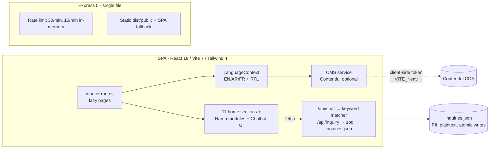
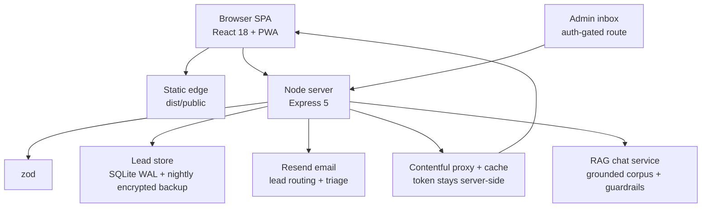

# AIABASD Website — Project Intelligence Report

**Date:** 2026-08-18 · **Repo:** `github.com/zexc66/aba` (`/tmp/aba`, branch `main`, synced with origin)
**State at analysis:** 2 commits, 81 staged uncommitted changes (cleanup pass: −10,848 lines), `tsc --noEmit` ✅, `pnpm audit` ✅ 0 vulnerabilities.

---

## 1. Executive Summary

AIABASD's website is a **trilingual (EN/AR/FR) institutional marketing + lead-generation SPA** for an Africa/Middle-East PPP infrastructure alliance with a claimed +$550M pipeline. Its only real job is to **convert sovereign and institutional counterparties into conversations** — credibility is the product.

The engineering foundation is above average: modern stack (React 18 / Vite 7 / Tailwind 4 / Express 5 / Zod), strict TypeScript passing clean, thoughtful server hardening (zod validation, per-IP rate limiting, PII-safe logs, atomic serialized lead persistence), lazy routes, PWA, and a genuine i18n architecture with RTL.

But the site currently **undermines the credibility it exists to create**:

1. **Fabricated content presented as fact** — hardcoded fake news articles (dated 2024) and 5-of-6 stock Unsplash photos in the Gallery posing as organizational activities. For an institution selling governance rigor, this is the single largest business risk in the repo.
2. **A lead form that reports success on failure** (`Contact.tsx` catch-block sets `sent=true`) — silently losing institutional inquiries, the site's only conversion.
3. **Leads land in a JSON file nobody is notified about** — no email/CRM routing, no admin surface.
4. **Compliance gaps**: dead `href="#"` Privacy/Terms links while collecting PII (UK HQ → GDPR exposure), no cookie/analytics consent, `maximum-scale=1` (WCAG zoom-lock fail).
5. **Marketing claims served by a chatbot** ("IRR: 22–30%") with keyword matching that cannot disclaim, qualify, or cite — legal exposure.

**Verdict:** do not rewrite. Harden the trust surface (Phase 0), complete what's half-built (CMS, i18n, SEO), then build the thing the "Investor Portal" promises (Phase 2–3: real data room + RAG assistant). Detailed roadmap and a 26-task execution backlog follow.

---

## 2. Current Project Understanding

| Dimension | Finding |
|---|---|
| **Org** | African International Alliance for Business & Sustainable Development — multi-country alliance structuring PPP/BOT programs (energy, logistics, agriculture, digital, cities) across 11 countries |
| **Product** | Corporate website: Home (11 sections), Hama Project page, Gallery, Investor Portal (access-request only), 404 |
| **Users** | DFIs & sovereign funds, private capital, governments/municipalities, EPC/operating partners, NGOs, press |
| **Core problem solved** | Establish institutional credibility and capture qualified inquiries |
| **Stage** | Pre-launch polish. No deploy config, no CI, no tests, no analytics, no monitoring. Self-audit doc claims "PRODUCTION_READY" — overstated |
| **Conversion paths** | Contact form → `/api/inquiry` → `inquiries.json`; Investor access request → same endpoint; newsletter → **dead** (`preventDefault` only) |
| **Languages** | EN/AR/FR with RTL + localStorage persistence. Hama page: EN/AR only (FR missing). Many component strings hardcoded EN |

## 3. Current Architecture

- **Data:** all site copy in `client/src/data.tsx` (962 lines, 3 locales); Hama copy duplicated inside `HamaProject.tsx`; news/gallery hardcoded in components.
- **CMS:** Contentful wired (`siteSettings.contentData`) but **`getCollection` never called** — Newsroom ignores it entirely.
- **PWA:** autoUpdate manifest + workbox (fonts cached; Unsplash images not).

## 4. Strengths

1. **Clean, current stack** — Vite 7, Tailwind 4, Express 5, Zod 4, TS 5.6; `tsc` clean; 0 known vulns; pnpm overrides patching transitive risks.
2. **Server hygiene above typical marketing-site bar** — zod schemas, payload caps (64kb), security headers, per-IP fixed-window rate limits with `Retry-After`, PII-free logs, error handler that maps parser errors to 400.
3. **Durable file store** — serialized read-modify-write queue, atomic tmp+rename writes, corrupt-file preservation instead of silent wipe (`server/storage.ts`).
4. **Real i18n architecture** — language context, RTL document sync, localStorage persistence, CMS-per-locale fetch with instant static fallback.
5. **Performance-minded frontend** — route-level `React.lazy`, memoized sections, console-stripped prod builds, PWA precache, preconnected fonts.
6. **Decomposed Hama page** (6 modules), data/props-driven home sections, shared design language (burgundy `#5a1f2e` / gold `#f2a007`).
7. **Self-auditing culture** — `aiabasd_production_audit.md` documents fixes with issue IDs.

## 5. Weaknesses

| # | Weakness | Evidence | Severity |
|---|---|---|---|
| W1 | Contact form shows success on network/server failure | `Contact.tsx:59-62` catch → `setSent(true)` | **Critical** |
| W2 | Fabricated newsroom (2024 dates) + stock photos as "our activities" | `Newsroom.tsx:15-43`, `Gallery.tsx:11-15` | **Critical** (business) |
| W3 | No lead routing — JSON file, zero notifications, no admin UI | `server/storage.ts` | **Critical** |
| W4 | Privacy/Terms dead links while collecting PII; no consent; UK HQ/GDPR | `Footer.tsx:175-176` | High (legal) |
| W5 | Chatbot asserts financial returns (IRR 22–30%), keyword-matched, no disclaimer | `chatService.ts:52` | High (legal) |
| W6 | SEO: no `sitemap.xml`/`robots.txt`, canonical pinned to root on every page, no hreflang, no JSON-LD; SPA with no prerender | `SEO.tsx:20-48`, `client/public/` | High |
| W7 | i18n incomplete: Hama has no FR; Contact/Newsroom/Gallery/Investor strings hardcoded EN; `font-arabic` class never defined in CSS | `HamaProject.tsx:20-159`, `index.css` | High |
| W8 | No tests, no CI, no README, no ESLint, no error monitoring, no analytics | repo root | High |
| W9 | 81 changes staged uncommitted — work can be lost | `git status` | Medium |
| W10 | Dead code: `useComposition`, `usePersistFn`, `useMobile`, `MagneticCursor`, `cms.getCollection` | import scan | Medium |
| W11 | Contentful CDA token ships in client bundle (acceptable for Contentful, but couples content to client + no cache layer) | `cms.ts:48-57` | Low-Med |
| W12 | `maximum-scale=1` viewport blocks zoom (WCAG 1.4.4) | `index.html:7` | Medium (a11y) |
| W13 | PII stored plaintext on disk, no retention policy/export | `inquiries.json` | Medium |
| W14 | `siteUrl` hardcoded to `aiabasd.org` with "replace" comment — if domain differs, every canonical/OG URL is wrong | `SEO.tsx:20` | Medium |
| W15 | 4,021-line inline `WorldMapSVG` in Home chunk; remote Unsplash images unbudgeted | `wc -l` | Medium (perf) |

## 6. Missing Capabilities

- **Admin/ops layer**: inbox for inquiries, status workflow, CSV export, notification email/webhook.
- **Program pages**: 7 flagship programs advertised, only Hama has a page. No reusable program template.
- **Real investor portal**: nothing exists behind the "Sovereign Access Terminal" — no auth, no documents, no data room.
- **Content operations**: CMS is wired but unused; no newsroom articles model, no media library usage.
- **Analytics & consent**: zero measurement — cannot answer "did anyone request access this month?"
- **SEO surface**: sitemap, robots, hreflang, Organization/NGO JSON-LD, per-locale OG.
- **Legal**: privacy policy, terms, cookie notice pages.
- **Delivery**: CI/CD, preview environments, uptime + error monitoring, backups of lead store.
- **Testing**: none (unit for storage/validation; smoke for API; visual for RTL).
- **Docs**: README with setup/env/deploy; Contentful schema doc; `.env.example`.

## 7. Skill & Agent Map (available in this harness)

| Project Need | Skill/Agent | Why / Where used | Priority |
|---|---|---|---|
| Security review of API + i18n surfaces | `security-reviewer` agent | Evidence-backed vuln pass before launch (PII, auth, injection) | **Critical** |
| Premium institutional redesign | `hallmark` (audit-first) or `redesign-existing-projects` | Audit + upgrade visual system without breaking function | High |
| Design quality gate | `critique-theater` / `plan-design-review` | 5-dimension scored review of the redesigned surface | High |
| Performance/a11y standards | `web-design-guidelines` (Vercel) | Applied during redesign: layout, type, motion, a11y | High |
| Motion polish (framer-motion site) | `emilkowalski-motion` | Tasteful micro-interactions, reduced-motion compliance | Medium |
| Visual QA & evidence | `agent-browser` + `full-page-screenshot` | RTL/EN/FR screenshots, form-flow verification | High |
| Replace stock imagery | `imagegen` / `image-poster` + `media-use` | Generate licensed-consistent institutional art until real photos arrive | High |
| Deploy handoff | `deploy-vercel-static` (or VPS guide) | Static + `/api` as serverless functions; needs Express adaptation | Medium |
| CI signals | `build-test` | Wire `check`/`build` into pipeline gates | High |
| Positioning research | `x-research`, `last30days` | How comparable sovereign alliances present credibility | Medium |
| Docs/newsroom content | `docs-page`, `blog-post` | Privacy policy page template; article layout once CMS live | Medium |
| AI chatbot (Phase 3) | `librarian` agent (research) + own RAG build | Grounded answers over programs/policies with guardrails | Medium |

**Not recommended:** GSAP skills (framer-motion already in use — don't dual-purpose animation libs), full template decks, or a CMS migration (Contentful is fine once actually used).

## 8. Feature Audit

| Feature | Verdict | Reasoning |
|---|---|---|
| Home 11-section structure | **KEEP** | Right IA for institutional audience |
| Hero + stats + counters | **KEEP/IMPROVE** | Claims ($550M, 9+ countries) need sourcing footnotes for credibility |
| Trilingual + RTL | **KEEP/IMPROVE** | Complete FR on Hama, define Arabic font, purge hardcoded EN |
| Programs section (7 cards) | **IMPROVE** | Each card should link somewhere — build program detail template |
| Countries + WorldMapSVG/NodalMap | **KEEP/IMPROVE** | Beautiful, but 4k-line SVG → lazy-load per-viewport |
| Governance/Testimonials/HUD decor | **KEEP** | Differentiator; verify testimonials are real & attributed |
| Team section | **KEEP** | Real people, real photos |
| Partners wall | **KEEP/IMPROVE** | Confirm partner consent; link logos to real entities |
| Newsroom | **REBUILD** | Fake articles → Contentful-backed, or honest "Announcements" with real items only |
| Gallery | **REBUILD** | Stock photos → real event/project photos (or generated placeholder art clearly marked) |
| Contact form | **FIX** | Honest error states; keep zod backend |
| Newsletter subscribe | **FIX or REMOVE** | Currently dead; wire to `/api/inquiry` type NEWSLETTER or cut |
| Investor "portal" | **REBUILD (staged)** | Keep as access-request now; build real data room in Phase 2 |
| Chatbot | **REBUILD (Phase 3)** | Keyword bot → grounded RAG with disclaimers, or downgrade to scripted FAQ |
| SearchCommand (⌘K) | **KEEP** | Nice institutional touch; extend to programs/news when they exist |
| PWA | **KEEP** | Marginal value for a marketing site but harmless; add image caching |
| Contentful integration | **KEEP/USE** | `getCollection` exists unused — make Newsroom consume it |
| `useComposition`/`usePersistFn`/`useMobile`/`MagneticCursor` | **REMOVE** | Dead code, no importers |
| **ADD**: Program detail template | **ADD** | One route, CMS-driven, covers 7 programs |
| **ADD**: Legal pages | **ADD** | Privacy/Terms/Cookies (GDPR, UK HQ) |
| **ADD**: Admin inbox | **ADD** | The ops half of lead capture |
| **ADD**: Analytics | **ADD** | Privacy-friendly (Plausible) + consent banner |

## 9. UX/UI Analysis

- **Journey**: single scroll page works for storytelling; but CTAs dead-end (Programs cards don't navigate; Investor portal leads to a form then bounces to Home).
- **Navigation**: 9 anchor links + gallery — crowded desktop bar; mobile menu OK. Add "Investor Portal" prominence and a persistent CTA.
- **Onboarding**: none for the investor persona — the highest-value user gets a form, not a teaser (e.g., gated one-pager after request).
- **States**: form error handling broken (W1); loading states exist (PageLoader, skeletons via motion); empty state only in Newsroom copy.
- **RTL**: direction flips, but hardcoded EN labels inside AR layout (Contact) reads as unfinished; `select-none` on investor page blocks copy of reference codes users may want.
- **Accessibility**: zoom-lock viewport (W12), decorative HUD text unannotated for screen readers, color contrast of gold-on-white chips to verify, motion without `prefers-reduced-motion` strategy.
- **Performance feel**: 0.8s page-transition fade on every route may feel sluggish; fonts = 3 families × many weights (trim to 2 families + variable font).
- **Premium wins**: consistent burgundy/gold system, editorial typography, monolithic headings — lean into restraint; remove Unsplash genericism (biggest "template smell").

## 10. AI & Automation Opportunities

| Problem | AI Solution | Architecture | Expected Value |
|---|---|---|---|
| Keyword bot fails real questions & makes financial claims | **Grounded program assistant**: RAG over program sheets, governance docs, FAQ; refuses out-of-scope; logs transcripts as inquiries | `/api/chat` → embeddings stored in pgvector/Upstash or in-file for small corpus → LLM with strict system prompt + citations | Answers institutional questions accurately; removes legal risk; captures intent |
| Leads rot unseen | **Lead triage agent**: classify inquiry type/urgency, draft reply, notify partner | Server hook after `saveInquiry` → LLM classify → email via Resend | Faster response on $-conversations |
| Content ops burden (3 locales) | **Translation consistency checker** in CI: diff keys across EN/AR/FR | Script + LLM compare missing/mismatched keys | Ends "FR missing on Hama" class of bugs |
| Newsroom empty until CMS is staffed | **Draft generator** from factsheets (human-approved) | Local script, not runtime | Speed to credible content |
| Program fact sheets | **Document intelligence**: extract structured fields from PDFs into program template data | Offline pipeline | 7 program pages in days not weeks |

Deliberately **not** recommended: autonomous agents touching the public site, AI-generated news (integrity risk), chatbot giving investment advice.

## 11. Architecture Recommendations (target)

Principles: keep the boring SPA; **move Contentful behind a server proxy with 10-min cache** (token off client, faster TTFB via HTML-shell caching); **SQLite (WAL)** replaces JSON when admin tooling lands (until then JSON is fine for volume); **email webhook immediately** on every inquiry; split `server/index.ts` into routes when it exceeds ~300 lines; add `GET /api/healthz`; keep single-instance in-memory rate limiting until multi-instance deploy forces Redis.

## 12. Security Review

**Solid already**: zod validation on both endpoints; 64kb body cap; nosniff/DENY/Referrer/Permissions headers; rate limits; PII kept out of logs; no secrets in repo; dependencies clean; `.gitignore` covers env + lead store.

**Findings (high-level, no secrets exposed):**
1. **No authentication anywhere** — fine today (no protected resource exists), but the moment a data room ships it must be real auth (one-time codes + session, document URLs signed & expiring), not a client-side gate.
2. **PII at rest plaintext** (`inquiries.json`) — acceptable interim; add file permissions, encrypted off-site backup, retention policy, and access log before launch.
3. **Client-side Contentful token** — Contentful CDA tokens are public-by-design, but proxying (§11) removes the footprint and enables caching.
4. **Chatbot prompt-injection surface** — future LLM bot must treat corpus + user input as untrusted; keyword bot is immune (its only sin is overclaiming).
5. **SPA fallback serves index.html for any GET including `/api/*` typos** — constrain the catch-all to non-`/api` paths.
6. **No CSP/HSTS** — add with report-only first; HSTS once TLS termination is known.
7. **`X-Frame-Options: DENY`** already set; keep `frame-ancestors` in CSP parity.
8. **Unvalidated `type` default is open-ended regex** — deliberately loose; tighten to an allow-list when admin triage depends on it.

## 13. Performance Review

- **Frontend**: lazy routes ✅; but Home chunk carries the 4,021-line map SVG — code-split it behind the Countries viewport (`React.lazy` on scroll). Trim Google Fonts to 2 variable families; self-host with `font-display: swap` + preload. Replace Unsplash hotlinks with local optimized `webp/avif` (also a privacy/brand issue).
- **Server**: static + SPA fallback is fine at this scale; add `Cache-Control: immutable` for hashed assets, `no-cache` for HTML; gzip/brotli at proxy.
- **Perceived speed**: 0.8s route fade + 1000ms min PageLoader (`minDuration={1000}`) — artificial slowness; drop to ≤300ms.
- **No LCP/CLS measurement** — add Lighthouse CI budget (LCP < 2.5s on 4G) once deployed.
- **Scale posture**: single instance, in-memory state — correct for an institutional site; revisit only with the data room.

## 14. Business/Product Opportunities

1. **Deal-flow front door**: the site's KPI should be *qualified conversations started*. Instrument the funnel (visit → program view → inquiry → meeting).
2. **Gated teasers**: one-page program fact sheets (PDF) behind email capture — instant lead magnet with existing content.
3. **Credibility artifacts**: publish governance framework, ESIA/ESMS overview, annual impact one-pager — the audience buys governance.
4. **Monetization**: not applicable directly (alliance model); the "product" is mandates — the data room (Phase 2) shortens due-diligence cycles, the highest-leverage internal ROI.
5. **Partnership amplification**: partner logos → co-published news → backlinks → domain authority.

## 15. Competitive Differentiation Ideas

- **Radical transparency dashboard**: live pipeline map with stage, jobs created, SDG alignment per program — no competitor alliance publishes this; instantly screenshot-able.
- **Trilingual excellence** (EN/AR/FR done *properly*, incl. typography) is genuinely rare in this sector and signals on-the-ground capability.
- **Documented governance in the open** (how KYC/AML/ESIA actually gate projects) converts compliance from claim to artifact.
- **Instant institutional response**: sub-24h acknowledged inquiries with reference IDs (backend already returns `reference` — surface it in UI).

## 16. Quick Wins (≤1 day each)

1. Fix Contact error path (W1). 2. Wire or remove newsletter. 3. Commit the staged cleanup + add README + `.env.example`. 4. Delete dead hooks/components. 5. Add `robots.txt` + `sitemap.xml` + per-route canonical/hreflang. 6. Remove `maximum-scale=1`. 7. Complete FR on Hama page. 8. Define Arabic font + load Noto Kufi/Amiri. 9. Replace/remove fake news + Unsplash gallery. 10. Surface inquiry `reference` ID in success toast. 11. Trim PageLoader to 300ms. 12. Real Privacy/Terms pages (or remove links).

## 17. Major Improvements

- Email routing + triage on every lead (Resend + classify).
- Contentful actually powering Newsroom/Gallery/Programs (+ schema doc).
- Program detail template + migration of 7 programs.
- SEO package: JSON-LD, hreflang, prerendered HTML shell (vite prerender or SSR-lite).
- Admin inbox (auth-gated) with status + CSV export; SQLite store.
- RAG chatbot replacing keyword matcher (guardrailed, disclaiming, transcript-capturing).
- CI: typecheck + build + Lighthouse budgets + i18n key-parity check.
- Accessibility pass (WCAG 2.2 AA audit + fixes).

## 18. Moonshot Ideas

1. **Public Impact Ledger**: verifiable, per-project milestones (schools rehabilitated, MW installed) — the alliance-equivalent of a public blockchain-style proof-of-delivery.
2. **Interactive pipeline explorer**: the NodalMap evolved into a filterable investor-grade deal screen (stage, ticket, IRR *range disclaimed*, SDG tags) — the differentiator §15 promises.
3. **AI partnership concierge**: counterparties describe their capability (capital, EPC, sovereign) → matched to live program needs → intro request routed to the right partner.
4. **Multilingual investor briefings**: auto-assembled, human-approved quarterly PDFs per program in 3 languages.

## 19. Project V2 Vision

The site becomes the **front door of a deal institution**: 
- **Public layer**: honest, sourced, trilingual storytelling; program pages; impact ledger; SEO-visible. 
- **Qualified layer**: authenticated Investor Data Room — program fact sheets, governance artifacts, document telemetry. 
- **Intelligence layer**: grounded assistant answering from the institution's own corpus; leads auto-triaged and routed in minutes with reference IDs. 
- **Ops layer**: admin inbox, CRM export, analytics funnel, monitoring. 
Architecture as §11; automation as §10; differentiators as §15. Everything incremental on the current codebase — no rewrite.

## 20. Prioritized Recommendations

**P0 — Critical**: W1 honest form errors · W2 remove fabricated content · W3 lead email notification · W4 legal pages · commit staged work · `pnpm audit` stays green.
**P1 — High Value**: SEO package · i18n completion · Contentful-powered Newsroom/Gallery · admin inbox + SQLite · CI/CD + README · analytics+consent · chatbot guardrails (or downgrade).
**P2 — Useful**: program template · performance pass (fonts/SVG/images) · accessibility audit · deploy pipeline · dead-code removal · Contentful proxy.
**P3 — Experimental**: RAG assistant · impact ledger · pipeline explorer · AI lead triage · partnership concierge.

## 21. Implementation Roadmap

| Phase | Tasks | Skills/Agents | Depends on | Outcome | Priority |
|---|---|---|---|---|---|
| **0 Critical Fixes** (week 1) | Honest form states; remove fake news/stock; wire newsletter; legal pages; commit cleanup; README + `.env.example`; constrain SPA fallback; reference-ID surfacing | code edits + `security-reviewer` pass | — | Trust surface intact; repo safe | P0 |
| **1 Foundation** (weeks 2-3) | i18n completion (FR/Hama, Arabic font, string extraction); SEO (sitemap/robots/hreflang/JSON-LD/canonicals); CI (typecheck+build); deploy + monitoring; analytics+consent | `web-design-guidelines`, `build-test`, `deploy-vercel-static`/VPS | Phase 0 | Findable, compliant, observable site | P1 |
| **2 Core Product** (weeks 3-6) | Contentful schema + Newsroom/Gallery wiring; program template + 7 programs; admin inbox + SQLite + CSV; email routing | CMS work + `agent-browser` QA | Phase 1 | Content ops + lead ops real | P1-P2 |
| **3 Intelligence** (weeks 6-9) | RAG chat with guardrails + transcript capture; lead triage; i18n parity bot in CI | RAG build + `librarian` | Phase 2 corpus | Accurate assistant, faster lead response | P3→P2 |
| **4 Growth** (weeks 9-12) | Investor data room (auth, signed docs, telemetry); gated fact sheets; partnership amplification; Lighthouse budgets | `security-reviewer` (auth), design skills | Phase 2 | The portal becomes real | P2-P3 |
| **5 Scale** (ongoing) | Redis rate-limit if multi-instance; backups; CSP/HSTS; a11y AA certification; impact ledger | ops + audit agents | Phase 4 | Institutional-grade operation | P2 |

## 22. Execution Backlog

| # | Task | Objective | Files | Skill/Agent | Deps | Risk | Acceptance criteria |
|---|---|---|---|---|---|---|---|
| B1 | Fix inquiry error path | Never show success on failure | `Contact.tsx` | — | — | Low | Offline submit → error state, no success UI |
| B2 | Remove fabricated content | No fake news/stock on site | `Newsroom.tsx`, `Gallery.tsx` | `imagegen` for placeholder art | — | Low (review copy) | Zero 2024-dated fake articles; gallery uses real/owned/marked images |
| B3 | Newsletter decision | Wire to `/api/inquiry` type NEWSLETTER or remove UI | `Newsroom.tsx`, `server/index.ts` | — | B1 | Low | Submit stores lead or UI removed |
| B4 | Commit staged work | Preserve cleanup | git | — | — | Low | Clean `git status`; build green |
| B5 | README + `.env.example` | Onboarding ≤10 min | root | — | — | Low | New dev runs site from README alone |
| B6 | Legal pages | Privacy/Terms/Cookies linked | `Footer.tsx`, new routes | `docs-page` | — | Med (legal review) | Footer links resolve; consent banner if analytics |
| B7 | SEO package | Crawlable + correct metadata | `SEO.tsx`, `vite.config.ts`, `public/` | `web-design-guidelines` | — | Low | sitemap+robots live; per-route canonical; hreflang; Organization JSON-LD |
| B8 | i18n completion | FR on Hama; Arabic font | `HamaProject.tsx`, `index.css`, `index.html` | — | — | Low | FR toggle shows FR on all pages; Arabic renders branded font |
| B9 | String extraction | Kill hardcoded EN | Contact/Newsroom/Gallery/InvestorLogin | — | B8 | Low | Switching AR/FR changes all visible strings |
| B10 | Lead email routing | Notify partners instantly | `server/`, Resend | — | B4 | Med (secret mgmt) | Inquiry → email in <60s with full record |
| B11 | Reference ID in UI | Close the loop with user | `Contact.tsx`, `InvestorLogin.tsx` | — | B1 | Low | Success toast shows server `reference` |
| B12 | SPA fallback constraint | No HTML for `/api/*` GETs | `server/index.ts` | — | — | Low | `GET /api/chat` → 404 JSON |
| B13 | CI pipeline | Gate every PR | `.github/workflows` | `build-test` | B4 | Low | PR fails on tsc/build errors |
| B14 | Analytics + consent | Measure the funnel | client + Plausible | — | B6 | Med (consent) | Visit→inquiry funnel visible per locale |
| B15 | Deploy + monitoring | Production home | host + uptime + Sentry | `deploy-vercel-static`/VPS | B13 | Med | HTTPS live; uptime + error alerts |
| B16 | Contentful schema + Newsroom | CMS-driven articles | `cms.ts`, `Newsroom.tsx` | — | B4 | Med | Articles from Contentful; fallback when unset |
| B17 | Gallery from CMS | Owned media library | `Gallery.tsx` | — | B16 | Low | Images from CMS assets |
| B18 | Program template | 7 program pages | new route + CMS model | `hallmark`/design skills | B16 | Med | Each Programs card links to populated page |
| B19 | Admin inbox | Ops for leads | server route + UI, auth | `security-reviewer` | B10 | High (auth) | List/filter/resolve inquiries; CSV export |
| B20 | SQLite migration | Durable store | `server/storage.ts` | — | B19 | Med | WAL mode; JSON→SQLite one-shot; backups |
| B21 | Perf pass | Budget-beating load | fonts, `WorldMapSVG` split, images | `web-design-guidelines`, `agent-browser` | B2 | Low | Lighthouse perf ≥90 mobile; LCP<2.5s |
| B22 | A11y pass | WCAG 2.2 AA | global | critique skills | B8/B9 | Med | Audit clean on zoom/contrast/ARIA/motion |
| B23 | Chatbot guardrails | Remove legal exposure | `chatService.ts` | — | — | Low | No uncited financial claims; scoped answers; or FAQ-only mode |
| B24 | RAG assistant | Grounded institutional bot | server + corpus | `librarian`, RAG build | B16, B18 | High | Answers cite corpus; refuses out-of-scope; logs leads |
| B25 | Lead triage | Auto-classify + draft reply | server hook | — | B10 | Med | Email includes type/urgency/draft |
| B26 | Data room v1 | Real investor portal | auth + docs | `security-reviewer` | B19 | High | Approved investor views signed-URL docs; telemetry |

## 23. Recommended First 10 Actions

1. **B1** fix the lying success state. 2. **B2** strip fabricated content. 3. **B4** commit the staged cleanup. 4. **B10** lead email routing. 5. **B3** newsletter wire/remove. 6. **B7** SEO package. 7. **B8+B9** i18n completion. 8. **B5** README + env example. 9. **B13** CI. 10. **B23** chatbot guardrails.

---

## If I owned this project, what would I change first — and why?

**Remove every fabricated artifact and make the lead path honest — before any feature work.**

This website has exactly one job: make a $550M-pipeline institution credible enough that a sovereign fund or DFI sends an email. Today it works against that job three ways — fake 2024 news articles, stock photos posing as project activity, and a form that congratulates users on inquiries that silently vanished. Any visitor who notices one of these (and due-diligence professionals are paid to notice) discounts *everything* else, including the genuinely strong governance story. The engineering is already good enough to carry the message; the message is currently the liability. Fix the trust surface (a week of work, backlog B1–B4, B10), then earn attention with the honest version — then build the data room that makes "Investor Portal" true.

**Awaiting approval before implementation.**
